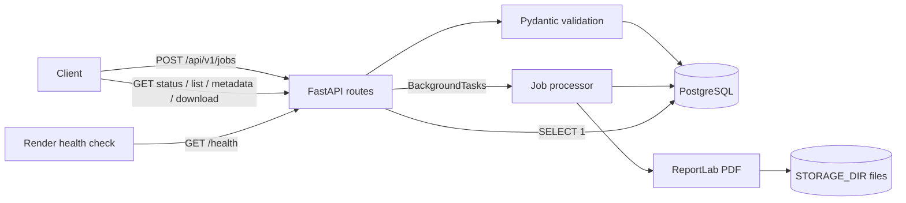

# Bulk Certificate Generator API

A backend service built for the **AEREO SDE-Intern assignment**. Issuing certificates one by one does not scale: each recipient needs an individually addressed PDF, and a single bad record should not sink an entire batch. This API accepts one request containing many recipients, validates the batch upfront, generates one PDF certificate per recipient as a **background job**, and exposes **job tracking with live progress**, per-certificate metadata, and PDF downloads.

- **Asynchronous bulk processing** — `202 Accepted` immediately, work continues in the background
- **Validation before anything is written** — an invalid batch leaves no partial rows
- **Failure isolation** — one recipient's generation failure never stops the rest of the batch
- **Job + certificate tracking** — statuses, counters, timestamps, and a `progress` fraction persisted in PostgreSQL

| | |
|---|---|
| **Live API** | <https://bulk-certificate-generator-vzzp.onrender.com> |
| **Swagger UI** | <https://bulk-certificate-generator-vzzp.onrender.com/docs> |
| **Health check** | <https://bulk-certificate-generator-vzzp.onrender.com/health> |
| **Source code** | <https://github.com/IrfanNaikwade28/BulkCertificateGenerator> |

## Try the live API in 2 minutes

**No installation required.** Use the interactive Swagger page to test the deployed API in your browser.

**Open Swagger UI:** <https://bulk-certificate-generator-vzzp.onrender.com/docs>

> **First request may be slow:** Render's free instance can spin down after inactivity. Wait for the page or request to respond instead of repeatedly submitting the same job.

### 1. Create a certificate job

1. Open Swagger UI.
2. Expand **`POST /api/v1/jobs`**.
3. Click **Try it out**.
4. Replace the request body with the example below.
5. Click **Execute** and copy the `job_id` from the response.

```json
{
  "certificate_title": "Certificate of Participation",
  "event_name": "Python Workshop 2026",
  "recipients": [
    {
      "name": "Rohan Patil",
      "email": "rohan.patil@example.com"
    },
    {
      "name": "Ananya Deshmukh",
      "email": "ananya.deshmukh@example.com"
    }
  ]
}
```

**Expected result:** `202 Accepted`, with a response similar to this:

```json
{
  "job_id": "<copy-the-job-id-from-your-response>",
  "status": "pending",
  "total_count": 2
}
```

The job ID above is a placeholder, not a real ID. Use the actual value returned by your request.

### 2. Check job progress

1. Expand **`GET /api/v1/jobs/{job_id}`**.
2. Click **Try it out**.
3. Paste your actual job ID into the `job_id` field.
4. Click **Execute**.

The job may initially be `pending` or `processing`. Execute this GET request again until the status is `completed` or `completed_with_errors`. A successful two-recipient run should show `succeeded_count: 2`, `failed_count: 0`, and `progress: 1.0`.

### 3. List the generated certificates

1. Expand **`GET /api/v1/jobs/{job_id}/certificates`**.
2. Enter the same job ID, then click **Execute**.
3. Copy a `certificate_id` from the `items` array.

### 4. Inspect and download a certificate

- Expand **`GET /api/v1/certificates/{certificate_id}`**, enter the certificate ID, and execute it to view metadata.
- Expand **`GET /api/v1/certificates/{certificate_id}/download`**, enter the same certificate ID, and execute it to download the PDF.
- A successful download returns **HTTP 200** with `Content-Type: application/pdf`.

Repeat the metadata/download steps for the second certificate if you want to inspect both PDFs.

### 5. Try request validation (optional)

To confirm invalid input is rejected, expand **`POST /api/v1/jobs`** again and submit this body:

```json
{
  "certificate_title": "Certificate of Participation",
  "event_name": "Validation Demo",
  "recipients": [
    {
      "name": "Invalid Email Example",
      "email": "not-an-email"
    }
  ]
}
```

**Expected result:** HTTP `422 Unprocessable Entity`. The request is rejected during validation, so it should not create a job or certificate rows.

### What to explore

- [ ] Create a job with your own certificate title and event name.
- [ ] Check job status, progress, and success/failure counters.
- [ ] List certificates and inspect their metadata.
- [ ] Download and open a generated PDF.
- [ ] Submit invalid input and observe the validation response.

## Table of contents

- [Live demo](#live-demo)
- [Try the live API in 2 minutes](#try-the-live-api-in-2-minutes)
- [Features](#features)
- [Architecture](#architecture)
- [Technology stack](#technology-stack)
- [API reference](#api-reference)
- [Quick start — local development](#quick-start--local-development)
- [Example: create a bulk job](#example-create-a-bulk-job)
- [Database and configuration](#database-and-configuration)
- [Deployment guide](#deployment-guide)
- [Design decisions and trade-offs](#design-decisions-and-trade-offs)
- [Testing](#testing)
- [Future improvements](#future-improvements)

## Live demo

| Link | URL |
|---|---|
| Live API | <https://bulk-certificate-generator-vzzp.onrender.com> |
| Swagger UI | <https://bulk-certificate-generator-vzzp.onrender.com/docs> |
| Health check | <https://bulk-certificate-generator-vzzp.onrender.com/health> |
| Source code | <https://github.com/IrfanNaikwade28/BulkCertificateGenerator> |

The **`/health` endpoint checks database connectivity**: it runs `SELECT 1` against PostgreSQL and returns `200 {"status":"ok"}` when the database is reachable, or `503 {"detail":"Database unavailable"}` when it is not.

> The service is deployed on Render's free plan, which suspends instances after inactivity. The first request after idle may take roughly 30–60 seconds while the instance wakes (it can briefly answer `503`). Subsequent requests respond normally.

## Features

- **Create bulk generation jobs** — `POST /api/v1/jobs` accepts a batch of recipients plus optional event details, returns `202` with a UUID job ID.
- **Validate event details and recipient data** — batch size limits, non-blank names, well-formed emails, duplicate-email rejection, and length limits on `certificate_title` / `event_name`. The whole batch is validated before any row is written.
- **Generate individual PDF certificates** — one predefined ReportLab template; the job's `certificate_title` and `event_name` are rendered into each certificate.
- **Track job status, progress, successes, and failures** — per-job counters (`processed`, `succeeded`, `failed`), a `progress` value from `0.0` to `1.0`, and `created_at` / `started_at` / `finished_at` timestamps.
- **Isolate failures per recipient** — a recipient whose PDF fails to render is recorded as `failed` with a sanitized `error_code`; the remaining recipients are still processed.
- **List certificates with pagination and status filtering** — `page`, `page_size` (max 200), and optional `status` query parameters.
- **Retrieve certificate metadata** — including a `download_url`; internal filesystem paths are never exposed.
- **Download individual PDF files** — served as `application/pdf` with a filename; `409` if the certificate is not ready yet.
- **Persist job and certificate metadata in PostgreSQL** — all state survives application restarts (local PostgreSQL in development, Neon in production).
- **Run database migrations with Alembic** — two versioned revisions build a schema from an empty database; no `create_all()` anywhere.
- **Health endpoint with a database connectivity check.**

Not included (and not claimed): Excel/CSV import, ZIP downloads, email delivery, authentication, or a frontend.

## Architecture

### Request flow

```text
Client
  → FastAPI routes (app/api/routes)          HTTP, status codes, response shaping
  → Pydantic schemas (app/schemas)            request validation, response models
  → SQLAlchemy models (app/models)            persistence in PostgreSQL
  → background processor (app/workers)        one fresh DB session per job
  → ReportLab (app/services/pdf_service)      one short transaction per recipient
  → file storage (STORAGE_DIR)                PDF written outside any transaction

Client ← certificate retrieval endpoints      status, list, metadata, download
```

`POST /api/v1/jobs` validates and persists the job plus one pending certificate row per recipient in a single short insert-only transaction, returns `202`, and only then schedules `process_job` through FastAPI `BackgroundTasks`.

The worker creates its **own** database session, marks the job `processing`, and walks each certificate independently: mark `processing` → commit → render the PDF → commit with `succeeded` (or roll back and record `failed`).

A transaction is never held open across PDF rendering, and a certificate is only ever marked `succeeded` after its file has been fully written (atomic temp-file + `os.replace`).

### Project structure

```text
app/
├── main.py                   # app factory, routers, safe global error handler
├── config.py                 # pydantic-settings + DATABASE_URL normalization
├── db.py                     # engine, session factory, get_db dependency
├── models/                   # Job, Certificate + status enums (UUID PKs)
├── schemas/job.py            # Pydantic request/response models
├── services/
│   ├── job_service.py        # job creation, queries, progress/status logic
│   ├── pdf_service.py        # ReportLab rendering
│   └── storage.py            # internal file paths (never exposed)
├── workers/job_processor.py  # background loop with per-recipient isolation
└── api/routes/               # jobs.py, certificates.py, health.py

templates/certificate_layout.py   # the single predefined certificate template
alembic/                          # versioned migrations (2 revisions)
tests/                            # pytest suite (58 tests)
docker/                           # PostgreSQL init script (creates test database)
Dockerfile, docker-compose.yml, render.yaml
```

### Data model and job lifecycle

**`jobs`** — `id (UUID PK)`, `certificate_title`, `event_name`, `status`, `total_count`, `processed_count`, `succeeded_count`, `failed_count`, `created_at`, `started_at`, `finished_at`.

**`certificates`** — `id (UUID PK)`, `job_id (FK → jobs, CASCADE)`, `recipient_name`, `email`, `status`, `error_code` (sanitized), `file_size_bytes`, `created_at`, `generated_at`.

```text
Job:       pending → processing → completed
                                      → completed_with_errors   (some failed)
                                      → failed                  (loop-level crash)

Certificate: pending → processing → succeeded | failed

progress = processed_count / total_count        (0.0 – 1.0)
```

Counters are incremented in the same transaction that persists each certificate's terminal state, so reported progress always matches reality.

### Mermaid diagram



## Technology stack

| Technology | Why it is used |
|---|---|
| **FastAPI** | Modern async-capable web framework; dependency injection for DB sessions, automatic OpenAPI/Swagger UI, and native Pydantic integration. |
| **Pydantic** (+ `pydantic-settings`) | Declarative request/response validation with precise `422` errors; environment-driven configuration in one place. |
| **SQLAlchemy 2.x** | Typed, declarative ORM (`Mapped` / `mapped_column`) with explicit session and transaction control — essential for the per-recipient commit strategy. |
| **PostgreSQL / Neon** | Relational guarantees (foreign keys, cascades, constraints) for job/certificate data. Local Dockerized PostgreSQL for development; **Neon** as the managed serverless database in production. |
| **Alembic** | Versioned, reviewable schema migrations that can build a database from empty — the only schema mechanism used (no `create_all()`). |
| **ReportLab** | Pure-Python PDF generation with precise layout control; no external binaries required in the container. |
| **pytest + HTTPX** | FastAPI's `TestClient` (built on HTTPX) exercises the real ASGI app end-to-end — routes, validation, background processing, and PDF downloads. |
| **Docker** | Reproducible image for local runs and for Render's Docker-based deploys; `docker-compose.yml` provides the local PostgreSQL. |
| **Render** | Deploys the GitHub repository with the included `render.yaml` Blueprint (free plan, Docker runtime, health-checked at `/health`). |

## API reference

Base URL (local): `http://localhost:8000` · Interactive docs: `/docs`

| Method | Path | Purpose | Success | Errors |
|---|---|---|---|---|
| `GET` | `/health` | Liveness + database connectivity check | `200` | `503` |
| `POST` | `/api/v1/jobs` | Create a bulk generation job | `202` | `422` |
| `GET` | `/api/v1/jobs/{job_id}` | Job status, counters, progress, timestamps | `200` | `404`, `422` |
| `GET` | `/api/v1/jobs/{job_id}/certificates` | Paginated certificate results for a job | `200` | `404`, `422` |
| `GET` | `/api/v1/certificates/{certificate_id}` | Certificate metadata (no file paths) | `200` | `404`, `422` |
| `GET` | `/api/v1/certificates/{certificate_id}/download` | Download the generated PDF | `200` | `404`, `409`, `422` |

### `GET /health`

Checks database connectivity (`SELECT 1`).

```json
{
  "status": "ok"
}
```

`503 {"detail": "Database unavailable"}` if the database cannot be reached.

### `POST /api/v1/jobs`

Request body:

| Field | Required | Rules |
|---|---|---|
| `recipients` | yes | 1–`MAX_BATCH_SIZE` (default 100) entries |
| `recipients[].name` | yes | non-blank after trimming, max 100 chars |
| `recipients[].email` | yes | valid email; duplicates within a batch rejected |
| `certificate_title` | no | 1–100 chars, default `CERTIFICATE OF ACHIEVEMENT` |
| `event_name` | no | 1–150 chars, default `the program` |

The **entire** request is validated before anything is written: a `422` response means zero job and zero certificate rows were created.

`202 Accepted`:

```json
{
  "job_id": "2a558eff-252a-41d3-972b-d839bdb6431f",
  "status": "pending",
  "total_count": 2
}
```

### `GET /api/v1/jobs/{job_id}`

`200 OK` (values shown after processing finished):

```json
{
  "job_id": "2a558eff-252a-41d3-972b-d839bdb6431f",
  "status": "completed",
  "total_count": 2,
  "processed_count": 2,
  "succeeded_count": 2,
  "failed_count": 0,
  "progress": 1.0,
  "created_at": "2026-10-09T07:15:46.391610Z",
  "started_at": "2026-10-09T07:15:46.416809Z",
  "finished_at": "2026-10-09T07:15:46.459942Z"
}
```

`status` is one of `pending`, `processing`, `completed`, `completed_with_errors`, `failed`.

`progress` equals `processed_count / total_count`. `started_at` / `finished_at` are `null` until processing begins / ends. Unknown or malformed IDs → `404` / `422`.

### `GET /api/v1/jobs/{job_id}/certificates`

Query parameters: `page` (≥ 1, default 1), `page_size` (1–200, default 50), `status` (optional: `pending`, `processing`, `succeeded`, `failed`).

`200 OK`:

```json
{
  "job_id": "2a558eff-252a-41d3-972b-d839bdb6431f",
  "items": [
    {
      "certificate_id": "2d50cb5f-c4f7-4266-be89-04fcc05263ee",
      "recipient_name": "Rohan Patil",
      "email": "rohan.patil@example.com",
      "status": "succeeded",
      "error_code": null,
      "generated_at": "2026-10-09T07:15:46.440205Z"
    },
    {
      "certificate_id": "fc9abb43-073a-459b-918f-95cd9c9ba662",
      "recipient_name": "Ananya Deshmukh",
      "email": "ananya.deshmukh@example.com",
      "status": "succeeded",
      "error_code": null,
      "generated_at": "2026-10-09T07:15:46.454771Z"
    }
  ],
  "total": 2,
  "page": 1,
  "page_size": 50
}
```

### `GET /api/v1/certificates/{certificate_id}`

`200 OK` — metadata only; filesystem paths are never included:

```json
{
  "certificate_id": "2d50cb5f-c4f7-4266-be89-04fcc05263ee",
  "recipient_name": "Rohan Patil",
  "email": "rohan.patil@example.com",
  "status": "succeeded",
  "error_code": null,
  "generated_at": "2026-10-09T07:15:46.440205Z",
  "job_id": "2a558eff-252a-41d3-972b-d839bdb6431f",
  "file_size_bytes": 2109,
  "created_at": "2026-10-09T07:15:46.398056Z",
  "download_url": "/api/v1/certificates/2d50cb5f-c4f7-4266-be89-04fcc05263ee/download"
}
```

A failed certificate reports `"status": "failed"` with the sanitized `"error_code": "GENERATION_FAILED"` — internal exception details are logged server-side only.

### `GET /api/v1/certificates/{certificate_id}/download`

`200 OK` with `Content-Type: application/pdf` and `Content-Disposition: attachment; filename="certificate-<id>.pdf"`.

- Certificate not `succeeded` yet → `409 {"detail": "Certificate is not ready for download"}`
- Unknown ID → `404`; record exists but the file is gone (e.g. after a redeployment) → `404 {"detail": "Certificate file not available"}`

### Error format

All errors use FastAPI's standard shape: `{"detail": "..."}` with `422` (validation), `404` (not found), `409` (conflict), `503` (database unavailable). Internal paths, tracebacks, and raw exception messages are never returned.

## Quick start — local development

Prerequisites: **Python 3.11+**, **Docker with Docker Compose**. Commands below are for Linux (tested on Fedora); they are unchanged on macOS/WSL except for your package manager.

```bash
# 1. Clone the repository
git clone https://github.com/IrfanNaikwade28/BulkCertificateGenerator.git
cd BulkCertificateGenerator

# 2. Create and activate a virtual environment
python3 -m venv .venv
source .venv/bin/activate

# 3. Install dependencies
pip install -r requirements.txt

# 4. Configure the environment (local development defaults)
cp .env.example .env

# 5. Start PostgreSQL — also creates the certgen_test database for the test suite
docker compose up -d db

# 6. Run Alembic migrations against the local database
alembic upgrade head

# 7. Start the API
uvicorn app.main:app --reload

# 8. Open Swagger UI
#    http://localhost:8000/docs

# 9. Run the test suite (the compose database must be running)
pytest
```

On Fedora, install the prerequisites first if needed:

```bash
sudo dnf install python3 docker docker-compose
```

Alternatively, use Docker's official installation instructions, then add your user to the `docker` group.

Alternative — run the API and database fully in containers:

```bash
docker compose up --build
```

API: `http://localhost:8000` · PostgreSQL: port `5432`.

> `docker-compose.yml` is for **local development and tests only**. Production uses Neon PostgreSQL on Render — see the [deployment guide](#deployment-guide).

## Example: create a bulk job

The example below is copy-pasteable against the local server (`http://localhost:8000`) — swap the base URL for `https://bulk-certificate-generator-vzzp.onrender.com` to run it against the deployed API. Replace every placeholder ID with the actual UUIDs returned by your own requests.

```bash
BASE=http://localhost:8000

curl -X POST "$BASE/api/v1/jobs" \
  -H 'Content-Type: application/json' \
  -d '{
        "event_name": "Python Workshop 2026",
        "certificate_title": "Certificate of Participation",
        "recipients": [
          {"name": "Rohan Patil", "email": "rohan.patil@example.com"},
          {"name": "Ananya Deshmukh", "email": "ananya.deshmukh@example.com"}
        ]
      }'
```

`202 Accepted` (record the `job_id`):

```json
{
  "job_id": "2a558eff-252a-41d3-972b-d839bdb6431f",
  "status": "pending",
  "total_count": 2
}
```

Poll job status (substitute your `job_id`; processing takes well under a second for small batches):

```bash
curl "$BASE/api/v1/jobs/2a558eff-252a-41d3-972b-d839bdb6431f"
```

```json
{
  "job_id": "2a558eff-252a-41d3-972b-d839bdb6431f",
  "status": "completed",
  "total_count": 2,
  "processed_coun
